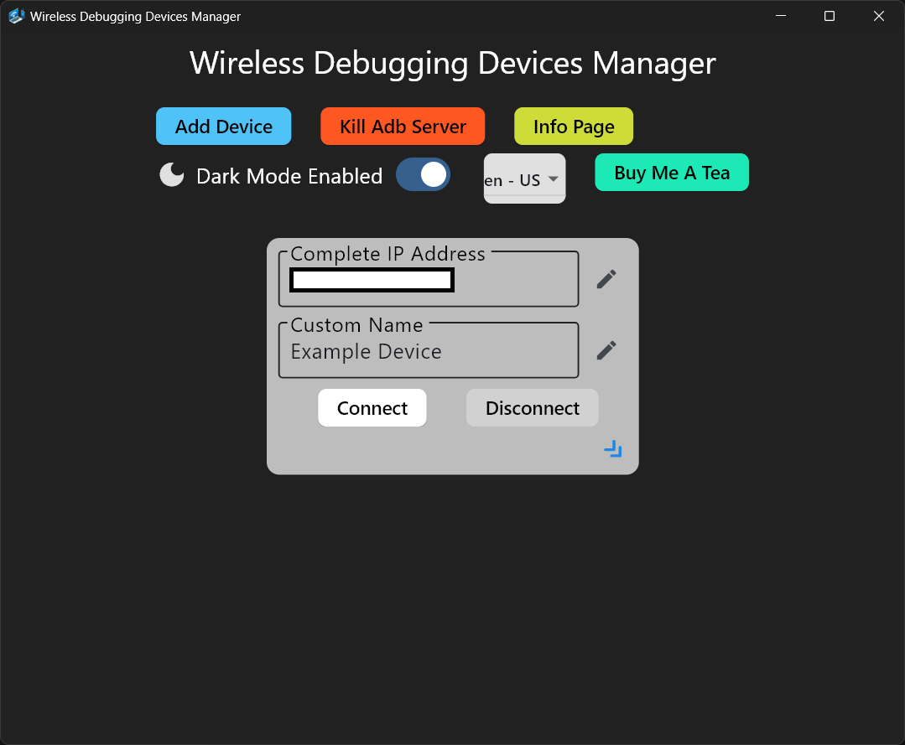
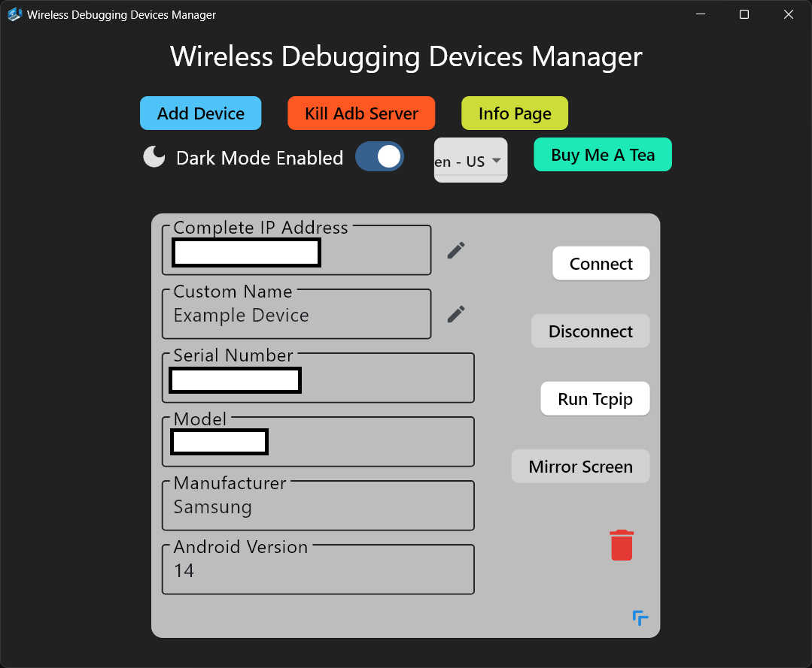
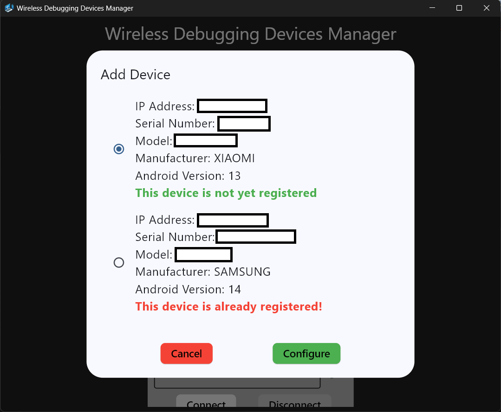

# Infos on how to use WDDM

Hello 👋 I'm the developer, ilCONDORA.

I hope you'll have a good time with the program. If you find any bugs or have suggestions to improve the program, please don't hesitate to contact me.

When you first start the app, you'll find a default device card. When you click the double arrow, it will expand the card, showing more information and actions.

As you can see, you can modify the 'Complete IP Address' and 'Custom Name', but only when you're disconnected from the device.

What you can do is:

- Connect to the device
- Disconnect from the device
- Run the Tcpip command (assign new port for connection, only when disconnected)
- Mirror and control the screen (powered by [scrcpy](https://github.com/Genymobile/scrcpy))
- Delete the device

To add a device, you need to click the 'Add Device' button situated at the top of the window in the row of buttons. You'll also find the 'Kill Adb Server' button that runs the `adb kill-server` command.

When you click the 'Add Device' button, you'll see a list of devices connected to the PC via cable. You can see that each item in the list indicates whether it is already present in your registered devices or not.

I don't really have anything else to add, so I hope you have a nice day.
Bye (👉 ﾟヮﾟ)👉.
